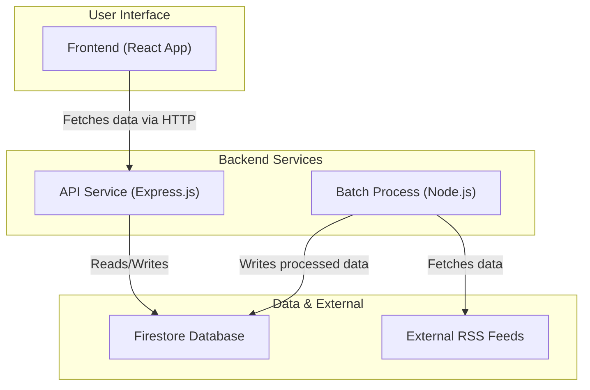
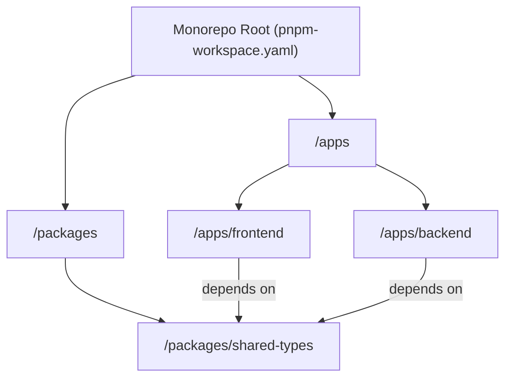
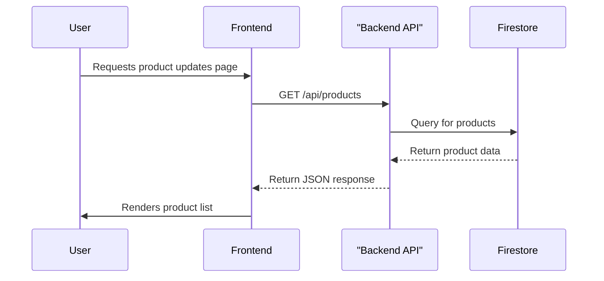
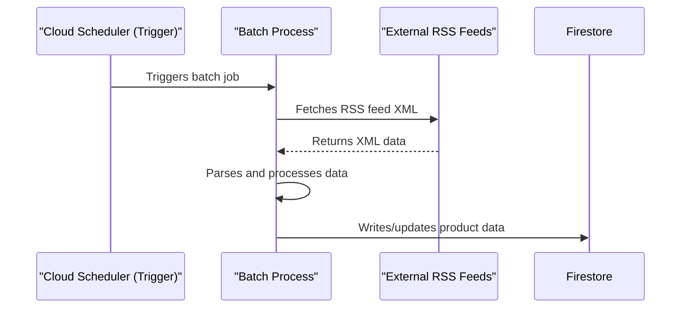
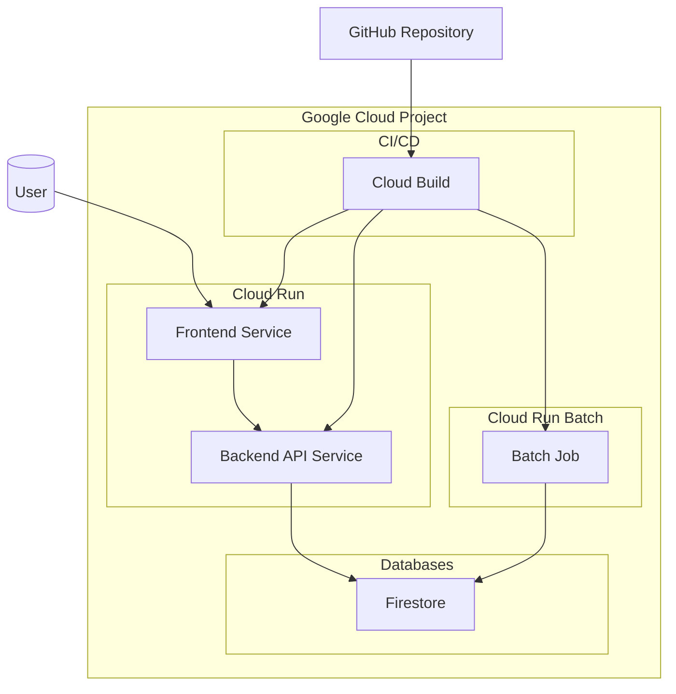
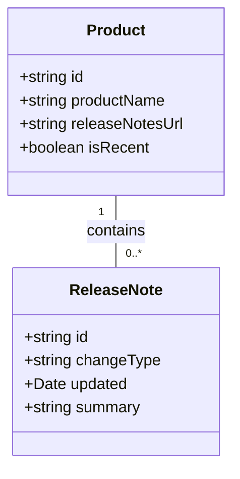
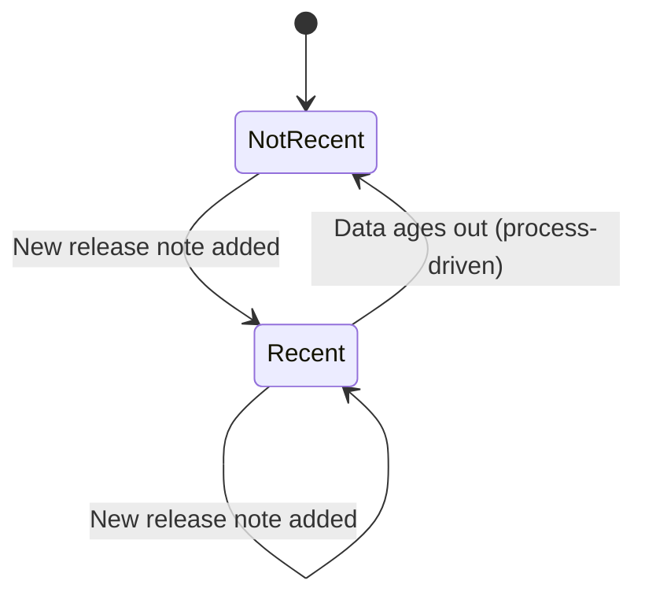

# System Design: Google Cloud Pulse

**Last Updated:** 2025-08-24

## 1. Introduction

### 1.1. Project Overview & Purpose
Google Cloud Pulse is a web application designed to provide a centralized and user-friendly view of the latest updates and release notes for various Google Cloud products. The system automates the process of fetching data from external RSS feeds, processing it, and storing it in a structured format. A React-based frontend then presents this data to the user, allowing them to easily track changes and new features across the Google Cloud ecosystem.

### 1.2. Goals & Non-Goals
*   **Goals:**
    *   To provide a single, consolidated view of Google Cloud product updates.
    *   To automate the data fetching and processing from various sources.
    *   To maintain a clean, intuitive, and responsive user interface.
    *   To have a clear architectural separation between the frontend and backend services.
    *   To establish a robust, automated CI/CD pipeline for reliable deployments.
*   **Non-Goals:**
    *   User authentication and personalization are not in the current scope.
    *   The system provides updates on a scheduled basis, not in real-time.
    *   Coverage is limited to products that provide a consumable RSS feed.

### 1.3. Technology Stack
*   **Languages:** TypeScript
*   **Frameworks & Runtimes:** Node.js, React, Express.js, Vite
*   **Databases:** Google Cloud Firestore
*   **Key Libraries:**
    *   **Backend:** `cheerio` (for HTML parsing), `@google/genai`, `winston` (logging), `jest` (testing)
    *   **Frontend:** `vitest` (testing), `react-testing-library`
*   **Package Manager:** pnpm (with workspaces)
*   **Deployment:** Google Cloud Run, Google Cloud Build

---

## 2. Architectural Views

### 2.1. Logical View (Component Diagram)
This diagram shows the high-level, logical components of the system and how they are interconnected.

### 2.2. Development View (Package Diagram)
This diagram illustrates how the source code is organized into packages within the pnpm monorepo.

### 2.3. Process View (Sequence Diagrams)
These diagrams show how components interact at runtime to accomplish key tasks.

**Use Case 1: User Views Product Updates**

**Use Case 2: System Updates Product Data (Batch Job)**

### 2.4. Deployment View
This diagram shows how the system's components are deployed to Google Cloud.

---

## 3. Data Design

### 3.1. Core Data Model (Class Diagram)
This diagram represents the main data entities, their attributes, and their relationships.

### 3.2. Entity State Lifecycle (State Diagram)
This diagram models the lifecycle of a critical data entity as it transitions through different states.

**Lifecycle of `Product.isRecent`:**

---

## 4. Cross-Cutting Concerns

### 4.1. Security
The application currently operates without user authentication, and the API is publicly accessible (`--allow-unauthenticated`). This is suitable for the initial goal of displaying public information. Future iterations requiring user-specific features would need to introduce a robust authentication and authorization layer (e.g., using Firebase Authentication or Identity Platform).

### 4.2. Scalability
The application is designed for scalability by leveraging serverless technologies. Both the frontend and backend API are deployed on Google Cloud Run, which automatically scales the number of container instances based on incoming traffic. The use of Firestore provides a scalable and managed NoSQL database that can handle large volumes of data and connections.

### 4.3. Logging & Monitoring
The backend service uses the `winston` library for structured logging. It is integrated with `@google-cloud/logging-winston`, which automatically sends logs to Google Cloud's operations suite (formerly Stackdriver) in a production environment. A request logging middleware is in place to log all incoming API requests, providing a clear audit trail of system activity.
